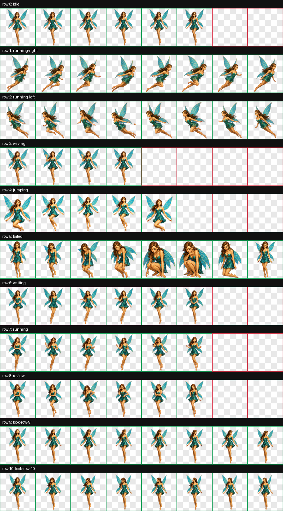

# Johnny5i and PixyPi PETs for Codex

Choose between two animated companions for the Codex desktop app and compatible
Codex CLI terminals:

- **Johnny5i**, a curious blue-eyed maintenance robot who explores, helps, and
  keeps watch over your workspace.
- **PixyPi**, a regal, fast-flying fairy mascot with a playful smile and golden
  pixy-dust spirit.

| Johnny5i | PixyPi |
| --- | --- |
|  |  |

Both packages use the Codex v2 sprite contract:

- 8 columns by 11 rows
- 192 by 208 pixels per animation cell
- 1536 by 2288 pixel transparent WebP sprite sheet
- Nine standard activity animations
- Sixteen clockwise look directions

## Repository contents

```text
johnny5i_PET_codex/
├── docs/
│   ├── johnny5i-preview.png
│   ├── pixypi-preview.png
│   └── VOICE_RUNTIME_INTEGRATION.md
├── pet/
│   ├── johnny5i/
│   │   ├── pet.json
│   │   ├── spritesheet.webp
│   │   └── voice/
│   │       ├── JOHNNY5I_IDENTITY.md
│   │       ├── johnny5i-identity.json
│   │       ├── LUMA_IDENTITY.md      # Historical correction pointer
│   │       └── luma-identity.json    # Machine-readable correction pointer
│   └── pixypi/
│       ├── pet.json
│       └── spritesheet.webp
├── scripts/
│   ├── install.ps1
│   └── install.sh
└── README.md
```

## Install on Windows

Open PowerShell in the repository and run:

```powershell
powershell -ExecutionPolicy Bypass -File .\scripts\install.ps1
```

The installer asks whether to install Johnny5i, PixyPi, or both. You can also
make the choice directly:

```powershell
# Install Johnny5i only
.\scripts\install.ps1 -Pet johnny5i

# Install PixyPi only
.\scripts\install.ps1 -Pet pixypi

# Install both pets
.\scripts\install.ps1 -Pet all
```

The installer places each selected package under:

```text
C:\Users\<your-name>\.codex\pets\
```

If a selected pet is already installed, the installer preserves it in a
timestamped folder under:

```text
C:\Users\<your-name>\.codex\pet-backups\
```

Backups remain outside the active `pets` directory so Codex does not scan them
as additional custom pets.

## Install on macOS, Linux, or WSL

Open a terminal in the repository and run the interactive installer:

```bash
bash ./scripts/install.sh
```

You can also choose directly:

```bash
bash ./scripts/install.sh johnny5i
bash ./scripts/install.sh pixypi
bash ./scripts/install.sh all
```

The installer uses `$CODEX_HOME` when it is defined. Otherwise, it installs
under `~/.codex/pets/`.

> [!NOTE]
> Codex Desktop on Windows currently has a known custom-pet discovery problem
> when its agent environment runs through WSL. If valid pets do not appear,
> switch the Codex **Agent environment** to **Windows native**, fully restart
> Codex, and refresh **Settings > Appearance > Pets**. Follow the
> [upstream Codex issue](https://github.com/openai/codex/issues/20730) for the
> status of native WSL custom-pet discovery.

## Install manually

Copy either or both package directories from `pet/` into the `pets`
directory under your Codex home. Keep both filenames unchanged inside each pet
directory:

```text
pet.json
spritesheet.webp
```

## Activate a pet

After installation:

1. Restart Codex, or open **Settings > Appearance > Pets** and select
   **Refresh**.
2. Choose **Johnny5i** or **PixyPi** from the custom pets list.
3. Choose **Wake Pet**.

For Codex CLI, enter `/pets` or `/pet` to open the pet picker. Terminal pets
require a terminal that supports iTerm2, Kitty graphics, or Sixel.

## johnny5i voice identity

johnny5i's voice identity matches the visual PET. When asked who he is, he should answer:

> I'm johnny5i, John's curious maintenance-robot PET.

The portable identity record is stored in [`pet/johnny5i/voice/JOHNNY5I_IDENTITY.md`](pet/johnny5i/voice/JOHNNY5I_IDENTITY.md), with structured data in [`johnny5i-identity.json`](pet/johnny5i/voice/johnny5i-identity.json).

Luma is a separate voice companion associated with the PixyPi PET. The two retained Luma files are correction pointers so an earlier local draft cannot be mistaken for johnny5i's identity.

Current Codex builds treat PET artwork and realtime voice identity as separate systems. The voice sidecar is installed with johnny5i, but it is not automatically loaded by the current voice runtime. See [`docs/VOICE_RUNTIME_INTEGRATION.md`](docs/VOICE_RUNTIME_INTEGRATION.md) for the verified boundary, bootstrap prompt, and acceptance checks.

## Web compatibility

These packages use the newer local v2 format at 1536 by 2288 pixels. The web
pet uploader may use a different sprite format. Install these packages through
the local Codex pets directory rather than uploading their sprite sheets
through the web interface.

## Sharing

You may share this repository directly or create an archive:

```bash
git archive --format=zip --output codex-pets.zip HEAD
```

Before public redistribution, confirm that you have permission to redistribute
any source artwork used as visual inspiration. The repository intentionally
contains the finished custom pet assets, not the original reference images.

## Troubleshooting

- Pet missing: confirm the agent environment is Windows native when using
  Codex Desktop on Windows, restart Codex, then refresh
  **Settings > Appearance > Pets**.
- Pet rejected: confirm `pet.json` and `spritesheet.webp` are in the same
  pet directory.
- Animation appears still: check whether reduced motion is enabled in the
  operating system.
- CLI pet missing: verify that the terminal supports inline graphics and that
  the session is not running inside tmux or Zellij.
